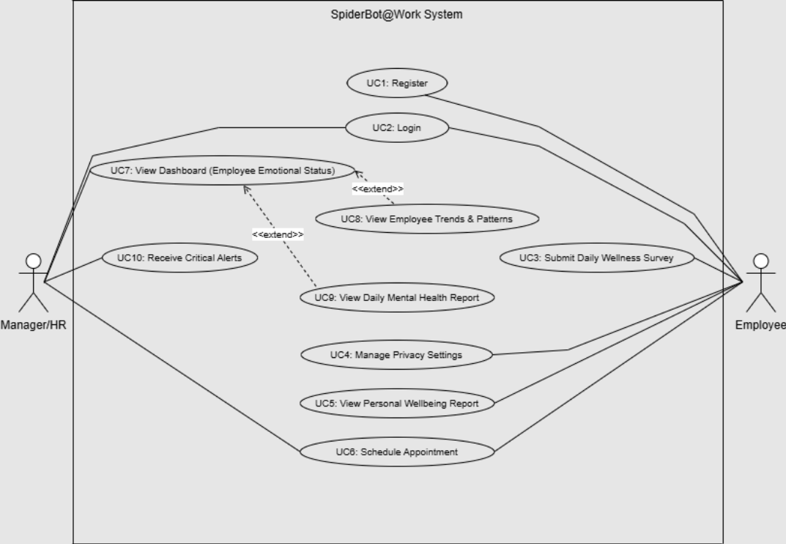
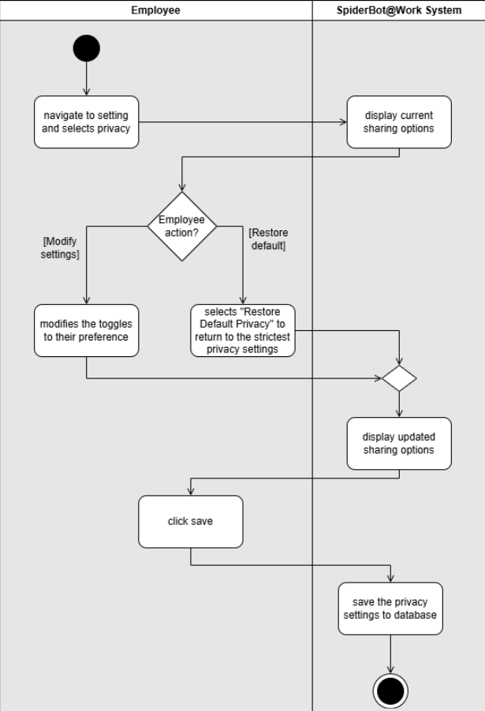
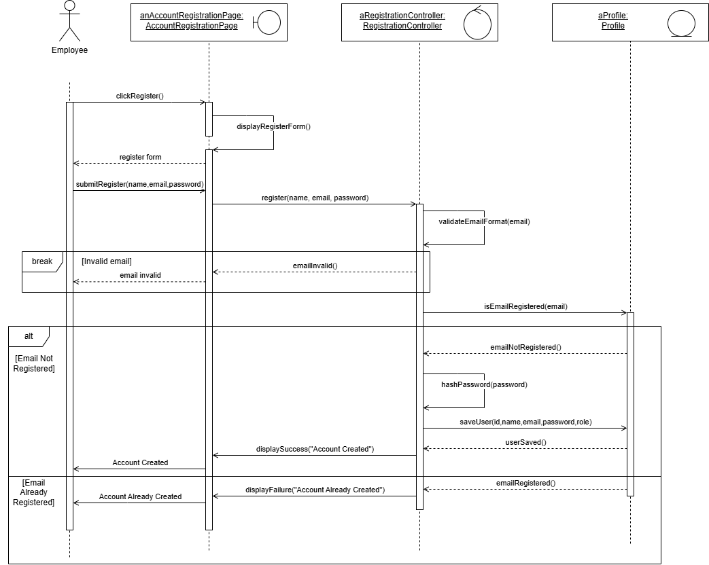
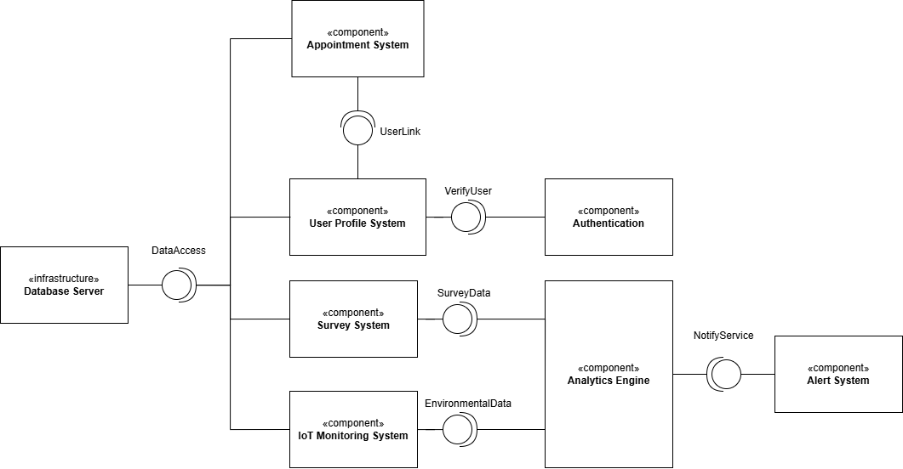

# SpiderBot@Work: AI & IoT System Design 🤖💼

### 🚀 Project Overview
SpiderBot@Work is a conceptual AI and IoT-powered workplace monitoring system designed to enhance employee well-being and productivity. This repository showcases the **Software Modeling** and **Architectural Design** phase of the SDLC, focusing on transforming complex mental health and environment monitoring requirements into technical blueprints.

### 🛠 Methodologies & Tools
- **Methodology:** Object-Oriented Analysis and Design (OOAD)
- **Modeling Language:** UML 2.0
- **Primary Focus:** Requirement Analysis, Behavioral Logic, and Physical System Architecture.

---

### 📊 System Architecture & Design Highlights

#### 1. Functional Requirements (UML Use Case Diagram)
The Use Case Diagram defines the system scope, illustrating interactions between Employees, HR Managers, and the core system features.
> 

#### 2. Process Flow (Activity Diagrams)
I modeled the detailed workflows for specific system behaviors, including Conflict Event Logging and automated notification triggers.
> 

#### 3. Interaction Logic (Sequence Diagrams)
These diagrams illustrate the chronological interaction between objects, showcasing how data flows between the UI, Controllers, and Database.
> 

#### 4. Implementation Structure (Component Diagram)
This diagram defines the modular structure of the system, showcasing the wiring between the User Interface, Sensor Processing, and Database modules.
> 

---

### 📝 My Contributions
As a **Software Modeler** in a team of five, I authored the following architectural artifacts:
- **Requirement Analysis:** Designed the high-level **Use Case Diagram** to establish system boundaries and actor permissions.
- **Dynamic Modeling:** Created **Activity and Sequence Diagrams** for critical use cases, ensuring logical consistency in automated workflows.
- **Structural Design:** Developed the **Component Diagram** to define physical software dependencies and modular boundaries.

### 🎓 Academic Context
- **Course:** Software Modelling (WIA2002)
- **Institution:** Universiti Malaya (UM)
- **Semester:** Semester 1, 2025/2026

---
**Disclaimer:** This repository is for portfolio purposes only, showcasing software modeling and architectural design skills. The full project report remains the property of the project contributors and Universiti Malaya.
